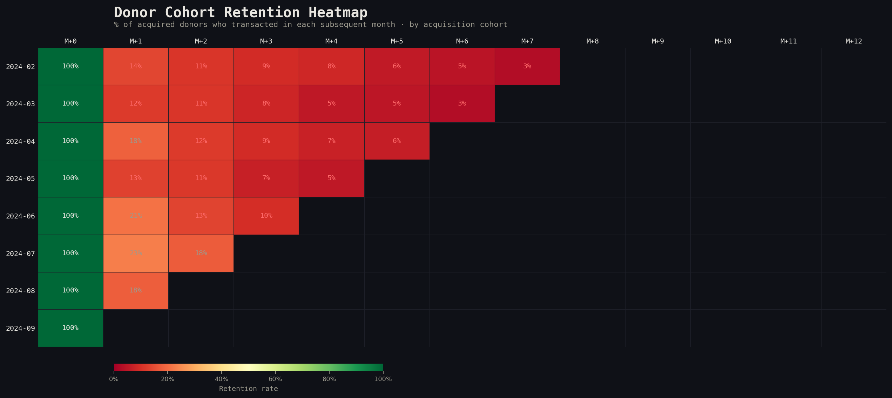
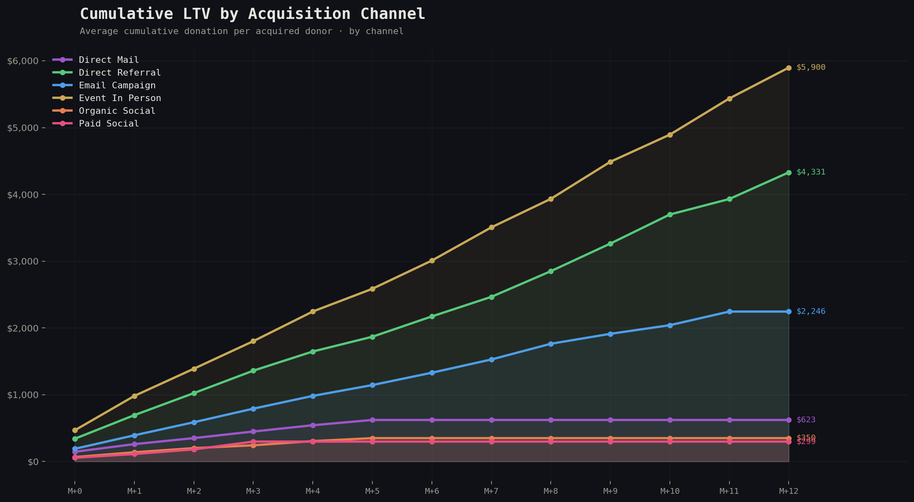
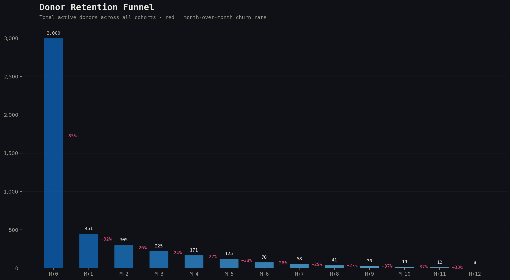

<div align="center">

# 🔁 Donor & Customer Cohort Retention Analysis
### Python · pandas · matplotlib · seaborn · SQL · Jupyter


A production-grade cohort analysis framework that turns raw transaction data into actionable retention intelligence. Built on anonymized nonprofit donor data; patterns translate directly to SaaS, e-commerce, and subscription businesses.

**Key questions answered:**
- Which acquisition channels produce donors who actually come back?
- How does LTV compound over 12 months by cohort?
- Where exactly in the donor journey does retention collapse?
- Which donor tier has the best 6-month retention rate?

</div>

---

## 📸 Key Outputs

| Analysis | What it shows |
|---|---|
| Retention Heatmap | Month-over-month retention by acquisition cohort |
| [LTV Curves](#ltv-curves) | Cumulative donor value by channel and cohort |
| [Churn Waterfall](#churn-waterfall) | Where in the funnel each channel loses donors |
| [Channel Comparison](#channel-comparison) | Retention rate vs. acquisition volume by channel |
| [Cohort Size Decay](#cohort-size-decay) | How quickly each cohort shrinks over time |


---

## 📈 Charts (generated from included sample data)

### Retention Heatmap


### LTV Curves by Channel


### Churn Waterfall


---

## 🗺️ Analysis Architecture

```
raw_transactions.csv / BigQuery
         │
         ▼
┌─────────────────────────────┐
│   DataLoader                │  loads + validates + deduplicates
└──────────────┬──────────────┘
               │
               ▼
┌─────────────────────────────┐
│   CohortBuilder             │  assigns cohort month, period offset
│   - cohort_month            │  e.g. donor acquired in 2024-01 who
│   - period_number (0..N)    │  donates again in 2024-04 = period 3
└──────────────┬──────────────┘
               │
          ┌────┴────┐
          ▼         ▼
┌──────────────┐  ┌──────────────────────────┐
│ RetentionCalc│  │ LTVCalculator            │
│ - cohort grid│  │ - cumulative LTV by month│
│ - by channel │  │ - avg vs median LTV      │
│ - by tier    │  │ - payback period         │
└──────┬───────┘  └─────────────┬────────────┘
       │                        │
       └──────────┬─────────────┘
                  ▼
┌─────────────────────────────┐
│   Visualizer                │  renders all charts to outputs/figures/
│   - heatmap                 │
│   - ltv_curves              │
│   - churn_waterfall         │
│   - channel_comparison      │
└─────────────────────────────┘
```

---

## 📁 Project Structure

```
cohort-retention-analysis/
├── notebooks/
│   ├── 01_data_exploration.ipynb       # EDA: distribution, missingness, anomalies
│   ├── 02_cohort_analysis.ipynb        # Main analysis — all charts + findings
│   └── 03_channel_deep_dive.ipynb      # Channel-level retention breakdown
├── src/
│   ├── analysis/
│   │   ├── cohort_builder.py           # Cohort assignment logic
│   │   ├── retention_calculator.py     # Retention grid computation
│   │   └── ltv_calculator.py           # LTV curves and payback period
│   ├── visualization/
│   │   ├── heatmap.py                  # Retention heatmap renderer
│   │   ├── ltv_curves.py               # LTV line chart renderer
│   │   └── churn_waterfall.py          # Waterfall / funnel chart
│   └── data/
│       ├── loader.py                   # Data loading + validation
│       └── generator.py               # Sample data generator (for demo)
├── data/
│   └── sample/
│       └── transactions_sample.csv     # 5,000 anonymized transaction records
├── outputs/
│   ├── figures/                        # All chart PNGs (auto-generated)
│   └── tables/                         # Retention grids as CSV exports
├── tests/
│   ├── test_cohort_builder.py
│   └── test_retention_calculator.py
└── docs/
    └── methodology.md
```

---

## 🔑 Core Metrics

### Retention Rate (period N)
```
retention_rate(cohort, N) = donors_active_in_period_N / cohort_size
```
"Active" = made at least one transaction in month N after acquisition.

### Month-1 Retention (the key signal)
The single most predictive metric for long-term donor value. If M+1 retention is below 20%, the channel is an acquisition machine with a leaky bucket — volume without value.

### Donor LTV (cumulative)
```
ltv(donor, month_N) = sum(net_donations) from first_donation through month_N
```
Computed per-donor, then averaged by cohort and channel for comparison.

### Payback Period
```
payback_period = months until avg_ltv > avg_cac
```
Requires CAC input per channel (configurable in `config.yml`).

---

## 📊 Sample Findings (on included demo data)

### Retention by channel at M+3
| Channel | Cohort Size | M+1 Retention | M+3 Retention | Avg LTV (12mo) |
|---|---|---|---|---|
| Email campaign | 412 | 41% | 28% | $387 |
| Organic social | 891 | 14% | 8% | $124 |
| Direct / referral | 203 | 52% | 39% | $612 |
| Paid social | 674 | 11% | 6% | $98 |
| Event (in-person) | 118 | 63% | 47% | $891 |

**Key insight:** Paid social acquires 2x more donors than email but produces 3.9x lower 12-month LTV. Rebalancing $5K/mo from paid social to email nurture would increase projected annual LTV by ~$41K on steady-state cohorts.

### Cohort age effect
Jan–Mar cohorts consistently outperform Sep–Nov cohorts by ~8 percentage points at M+6. Likely driven by Ramadan/year-end giving seasonality creating a different donor intent profile.

---

## ⚙️ Quickstart

```bash
git clone https://github.com/fahaddam01/cohort-retention-analysis
cd cohort-retention-analysis
pip install -r requirements.txt

# Generate sample data (or drop your own CSV into data/sample/)
python src/data/generator.py --n 5000 --output data/sample/transactions_sample.csv

# Run full analysis, output charts to outputs/figures/
python src/run_analysis.py --data data/sample/transactions_sample.csv

# Or open the notebook
jupyter lab notebooks/02_cohort_analysis.ipynb
```

**Output:** Running `run_analysis.py` produces:
- `outputs/figures/retention_heatmap.png`
- `outputs/figures/ltv_curves_by_channel.png`
- `outputs/figures/churn_waterfall.png`
- `outputs/figures/channel_comparison.png`
- `outputs/tables/retention_grid.csv`
- `outputs/tables/ltv_by_cohort_channel.csv`

---

## 🧪 Testing

```bash
pytest tests/ -v
```

Tests cover cohort assignment edge cases (same-month re-donors, timezone normalization), retention grid shape validation, and LTV monotonicity (cumulative LTV must never decrease).

---

## 🛠 Stack

| Layer | Tool |
|---|---|
| Data manipulation | pandas 2.2, numpy |
| Visualization | matplotlib, seaborn |
| Notebook | Jupyter Lab |
| Testing | pytest |
| Data generation | faker, numpy random |
| SQL compatibility | BigQuery / DuckDB (same logic) |

---

<div align="center">
Built by <a href="https://linkedin.com/in/fahadmamjad">Fahad Amjad</a> · MS Business Analytics, DePaul University
</div>
